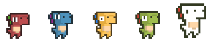

# Tower Defense with Q-Learning RL Agent

A tower defense game built in Godot 4 with an integrated reinforcement learning agent that learns to play autonomously using tabular Q-Learning.



---

## Overview

This project combines a fully playable tower defense game with a Q-Learning agent that trains itself to defend against waves of enemies. The agent learns which turret types to buy and when, discovering emergent strategies across repeated playthroughs.

Built as a capstone project. One notable finding: the agent discovered that the Earth Turret was significantly overpowered — something not apparent during manual playtesting.

---

## Gameplay

Defend your base against 50 waves of elemental dinosaur enemies. Place turrets strategically to exploit elemental weaknesses before your base HP reaches zero.

**Enemies** (each with an elemental type):
| Enemy | Type | HP |
|---|---|---|
| Red Dino | Fire | 25 |
| Blue Dino | Water | 40 |
| Yellow Dino | Wind | 33 |
| Green Dino | Earth | 25 |
| White Dino | Normal | 20 |

**Turrets:**
| Turret | Cost | Style |
|---|---|---|
| Basic | 25 | Fast projectile, low damage |
| Water | 30 | Medium projectile |
| Fire | 70 | Rapid-fire, high pierce |
| Wind | 30 | Ray beam, long range |
| Earth | 70 | AOE, high damage |

---

## The RL Agent

The agent uses tabular Q-Learning — no neural network.

**State representation**
Each state is encoded as a string key:
```
Wave{n}_HP{hp%}_W{water}F{fire}E{earth}Wi{wind}B{basic}
```
e.g. `Wave3_HP80_W2F1E0Wi0B1`

**Action space** (6 actions):
`Buy Water` · `Buy Fire` · `Buy Earth` · `Buy Wind` · `Buy Basic` · `Wait`

**Reward structure:**
- +10 base per wave cleared (scales with wave number)
- -2 per HP lost
- +100 / -100 for win / loss
- Bonuses for turret diversity and wave-appropriate choices

**Hyperparameters:**
- Learning rate α = 0.1
- Discount factor γ = 0.9
- Exploration rate ε = 0.2 (epsilon-greedy)

After each training run the Q-table is saved to `QTables/` as a timestamped JSON file. Game logs are saved to `GameLogs/`.

---

## Running the Project

**Just want to play?** Download the latest build from [GitHub Releases](../../releases/latest) — no Godot install needed.

**Requirements:**
- [Godot 4.3+ (.NET build)](https://godotengine.org/download/)
- .NET SDK 6.0+

**Setup:**
1. Clone the repo
2. Open `MyTowerDefenseGame/project.godot` in Godot (.NET build)
3. Build the C# project (Build button in Godot editor)
4. Press F5 to run

**Play Game** — human mode, normal 60fps gameplay. Place turrets by clicking the panel at the bottom.

**Train AI** — the agent plays automatically. Use the speed slider (up to 10×) to accelerate training. Default run: 25 games. Configurable via `total_games_target` in `Globals.gd`.

---

## Project Structure

```
MyTowerDefenseGame/
├── MyAIProject/        # Q-Learning agent (QAgent, PlayerAgent, GameState, logging)
├── Scenes/
│   ├── main/           # Core game loop, AiManager, UiController, Globals, Data
│   ├── maps/           # Map scenes and enemy spawner
│   ├── turrets/        # Turret scene implementations (projectile, wind, earth)
│   ├── enemies/        # Enemy movement
│   └── ui/             # Main menu, HUD, game over screens
└── Assets/             # Sprites and textures
```

---

## Tech Stack

- Godot 4, GDScript, C#
- Tabular Q-Learning (no neural network)

---

## License

MIT
